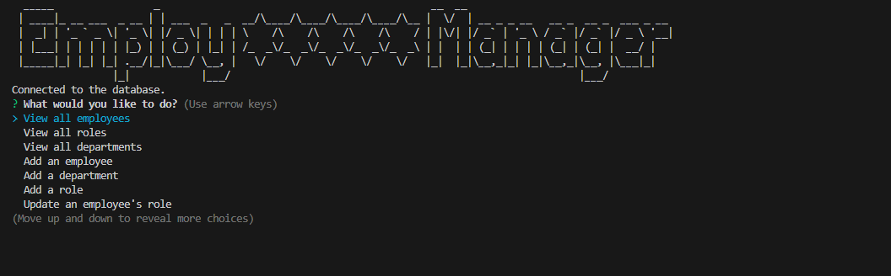
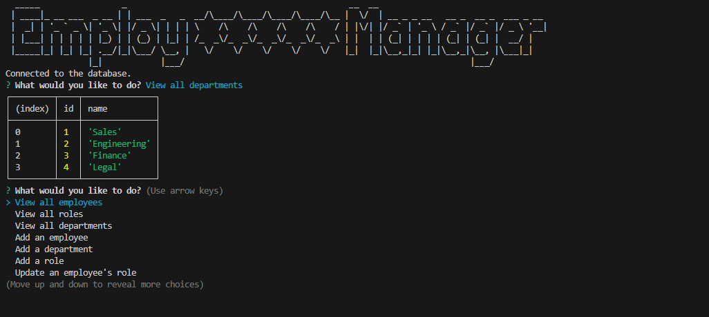

# SQL: Employee Tracker

Challenge Description

This Challenge is an employee management application that allows users to interact with a database of employees, roles, and departments through a command-line interface.

## Implemented Features:

#### Data Viewing: 
Users can view all employees, roles, and departments in formatted tables, making the information easy to understand.
#### Data Addition:
 Options have been implemented to add new employees, roles, and departments to the database.
#### Data Update: 
Users can update the role of an existing employee, ensuring that the information is always current.
#### Data Deletion: 
The application also provides functionality to delete employees, roles, and managers.

Use of **ASCII Art:** To enhance the visual experience in the terminal, the **ascii-art** package was used, allowing for messages and titles to be displayed in a more appealing style. This was achieved by integrating the package into the application's flow, providing a distinctive and professional look to the user interface.

## Demo
video demostration:
https://drive.google.com/file/d/12ADPgAnFxuNoE7an-CG5bMTRrG6xzaiT/view?usp=drive_link

## Screenshots:

#### Second ScreenShot.

